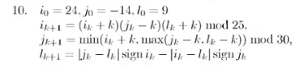

# Отчет по курсовой работе N 3 по курсу
# "Фундаментальная информатика"

Студент группы: M8О-115Б, Самарский Ярослав Вадимович\
Контакты: yaroslav.samarskij@mail.ru \
Работа выполнена: 30.10.2023\
Преподаватель: Чеснов Илья Игоревич

## 1. Тема

Написание программ на языке Си

## 2. Цель работы

Написать программу на языке Си, выполняющую поиск точки подходящей по условию.

## 3. Задание

Вариант 10. \


## 4. Оборудование

Процессор: Intel Core i5-8265U @ 8x 3.9GH\
ОП: 7851 Мб\
НМД: 1024 Гб\
Монитор: 1920x1080

## 5. Программное обеспечение

Операционная система семейства: **Windows 10**, версия **19045.2965**\
Интерпретатор команд: **cmd.exe**, версия **--**.\
Система программирования: **Visual Studio 2022**, версия **17.6.2**\
Редактор текстов: **Visual Studio 2022**, версия **17.6.2**\
Утилиты операционной системы: **--**\
Прикладные системы и программы: **MSVC**, версия **19.36.32532**\
Местонахождение и имена файлов программ и данных на домашнем компьютере: **C:\\Users\\Student_DT\\source\\repos\\Lab_30_10\\Lab_30_10**

## 6. Идея, метод, алгоритм решения задачи

Написать пошаговую реализацию движения точки в цикле

## 7. Сценарий выполнения работы

1. Проверяем попадает ли точка в заданную область
2. Вычисляем следующую, если не попадает
3. Если не попали с 50 раза, выводим сообщение об ошибке и завершаем программу

## 8. Распечатка протокола

```
Point: {X: 24, Y: -14}, L: 9
Point: {X: 0, Y: 8}, L: 38
Point: {X: 5, Y: 2}, L: -38
Point: {X: 5, Y: -1}, L: -3
Point: {X: -20, Y: -5}, L: 10
Point: {X: 0, Y: -15}, L: 15
Point: {X: -21, Y: 6}, L: 15
Successful: Point: {X: 8, Y: -14}, L: -45
```

## 9. Дневник отладки

| № | Лаб. или дом. | Дата       | Время     | Событие                                 | Действие по исправлению   | Примечание     |
|---|---------------|------------|-----------|-----------------------------------------|---------------------------|----------------|
|1  | Лаб           | 30.10.2023 | 10:45     | Не поставил точку с запятой             | Поставил ;                | Глупая ошибка  |
|2  | Лаб           | 30.10.2023 | 10:50     | Неожиданный ответ                       | Исправил алгоритм         |                |

## 10. Замечания автора по существу работы

Крайне занимательная работа, на Си гораздо проще писать алгоритмы, чем на Машине Тьюринга

## 11. Выводы

На Си можно написать любую вычислимую функцию гораздо быстрее, чем на Машине Тьюринга или НАМ
